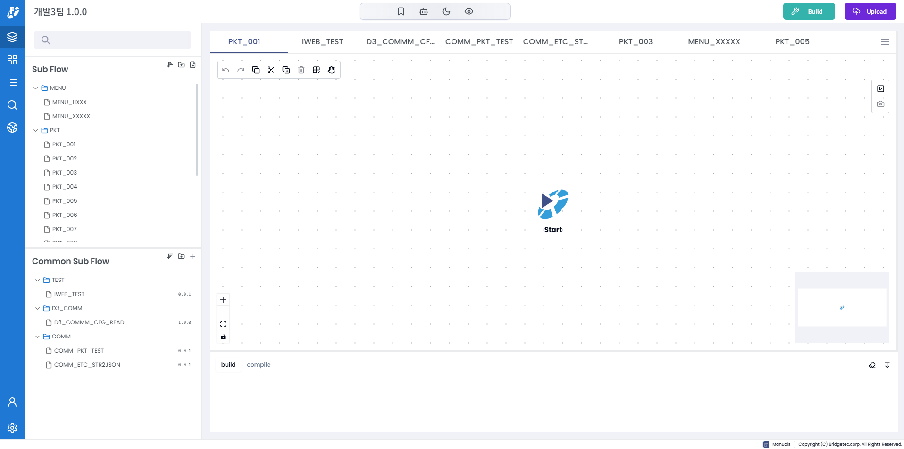
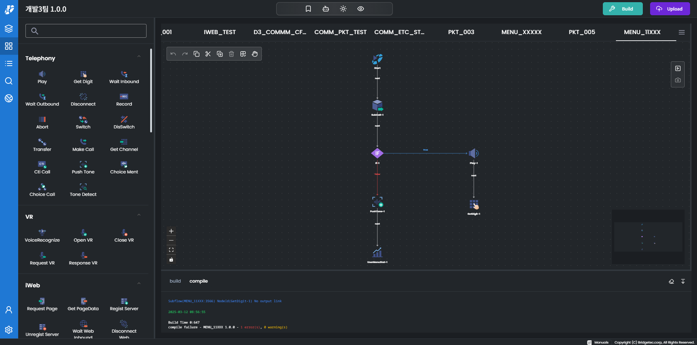

# ICC-IFE

#### 개발 배경

사내에서는 오래전부터 **MFC 기반의 `IVR` 시나리오 에디터**를 사용해 왔습니다. 이 프로그램은 `IVR`에서 `DTMF` 입력 등 콜 관련 시나리오를 개발하는 **전용 IDE**이며, 이를 활용해 고객사별로 커스터마이징된 시나리오를 제작하는 전담 개발팀이 존재합니다.

하지만, 사내에서 **클라우드 환경을 지향하는 전략**을 추진하면서 해당 에디터의 웹 전환 필요성이 대두되었습니다. 기존에도 웹 이식을 시도한 적이 있었지만, 여러 제약으로 인해 진행이 어려운 상태였습니다.

이러한 상황에서 `xyflow`를 활용한 웹 전환 가능성을 확인하였고, 이를 기반으로 프로젝트를 착수하여 성공적으로 완료하였습니다.

#### 주요 기능

- 빌드, 디버깅 지원
- `copy`, `paste`, `undo`, `redo` 지원
- 다크모드 지원
- 엣지 정렬 기능
- 멀티 엣지 기능
- 검색 기능
- 스냅샷 기능
- import / export 기능

#### 참가 인원

- 2인

#### 개발 기여도

- 80%
- PL 담당

#### 기술 스택

`react18`, `Next.Js 14 app router`, `xyflow`, `yup`, `react-hook-form`, `tanstack-query`,`zustand`, `docker`, `nginx`, `ag-grid`, `tailwind-css`, `shadcn`, `story-book`, `jest`, `msw`, `yjs`, `w-socket`

------

https://github.com/user-attachments/assets/fa8d23bc-7b42-498a-b660-fc495d3e1ccc

https://github.com/user-attachments/assets/59789318-a0b4-4009-9025-afe4f3dd05d4

https://github.com/user-attachments/assets/cc110012-cdef-4ea5-851f-977bc56a7054

