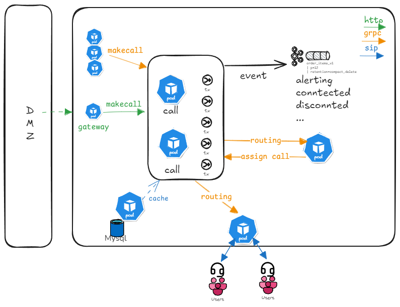

# IPRON-NE



### 폴더 구조

```bash
.
├── build
│   ├── bin
│   │   └── call
│   ├── package
│   │   └── Dockerfile
│   └── report
│       ├── coverage.out
│       ├── lint.xml
│       ├── test.log
│       └── test.xml
├── configs
│   └── env.go
├── go.mod
├── go.sum
├── internal
│   ├── adaptor
│   │   ├── broker
│   │   ├── metric
│   │   └── rpc
│   ├── core
│   │   ├── domain
│   │   ├── dto
│   │   ├── handler
│   │   ├── repository
│   │   ├── service
│   │   └── usecase
│   └── pkg
│       ├── cache
│       ├── crypto
│       ├── eventhandler
│       ├── exception
│       ├── grpc
│       ├── kafka
│       ├── kms
│       ├── logger
│       ├── platform
│       ├── prometheus
│       ├── regex
│       ├── tracer
│       ├── types
│       ├── utils
│       └── validator
├── Jenkinsfile
├── Makefile
├── README.md
├── test
├── tools
└── values.yaml
```

### 트랜잭션 처리


주요 기능

- 음원 재생
- 부가서비스
- 번호 편집
- 라우팅
- 콜 이벤트 처리
- 트랜잭션 처리
- 무중단 서비스

#### 개발 인원

- 1인

#### 개발 기여도

- 100%

#### 기술 스택

`OOP`, `golang`, `gRPC`, `grpc-gateway`, `kafka`, `redis`, `voip`, `pbx`, `IPT`, `IPCC`, `kubernets`
